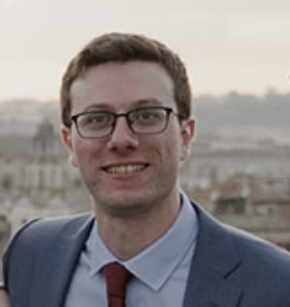

## About

I'm a postdoctoral researcher in the [Department of Linguistics](https://www.uni-potsdam.de/en/ling/index) of the University of Potsdam and a member of the [Potsdam Morpho-Syntax Lab](https://sites.google.com/view/potsdam-msl/home). 

I got my PhD from MIT in 2023.

My main research interests are in syntax and morphology⁠.

## My name

It's pronounced [stanizˈlao dzomˈpi] and spelled with a grave accent on the final *i*. (I myself have been inconsistent in this regard; now I'm trying to fix that.)

## News

* I will be at NELS 55 in October to present some collaborative work on the PCC and polite pronouns with [Luke Adamson](https://lukejamesadamson.wixsite.com/linguistics).