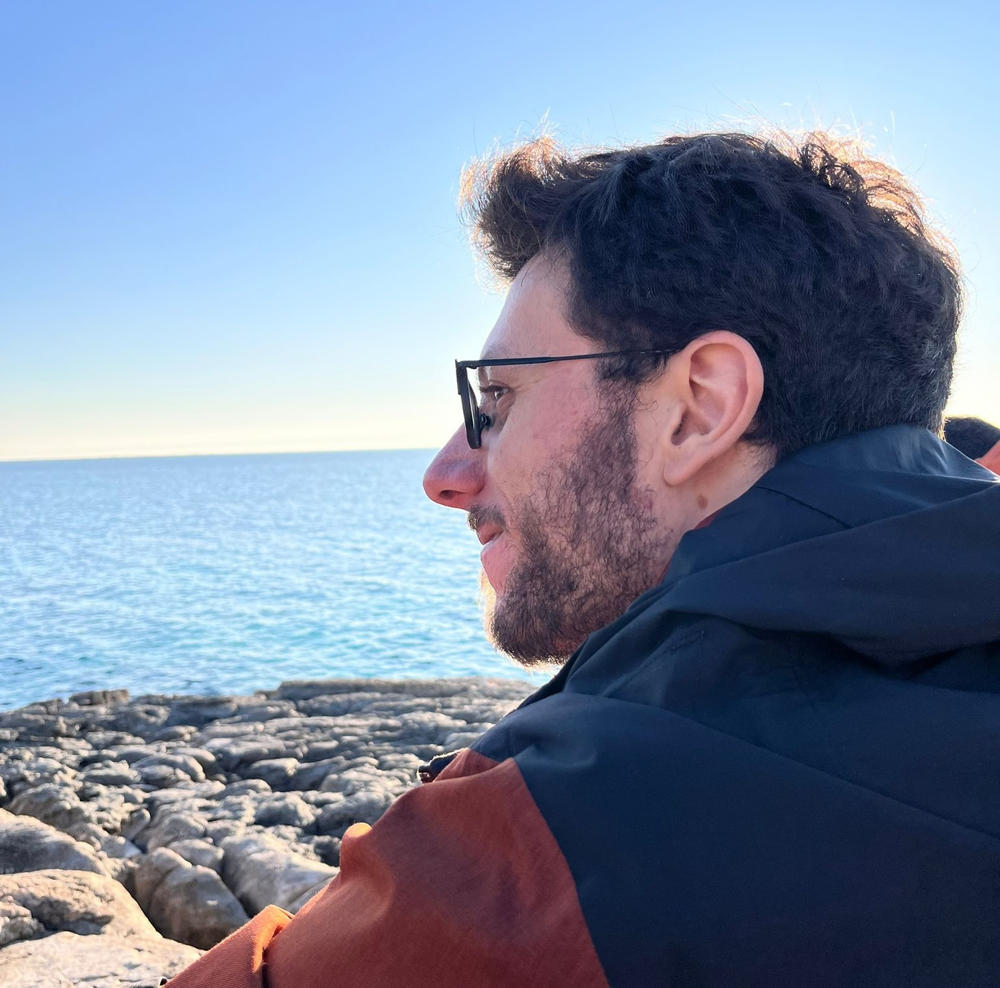

## About

I'm a postdoctoral researcher in the [Department of Linguistics](https://www.uni-potsdam.de/en/ling/index) of the University of Potsdam and a member of the [Potsdam Morpho-Syntax Lab](https://sites.google.com/view/potsdam-msl/home). 

I got my PhD from MIT in 2023.

My main research interests are in syntax and morphology⁠.

## My full name

It's pronounced [stanizˈlao dzomˈpi] and spelled with a grave accent on the final *i*. (I myself have been inconsistent in this regard; now I'm trying to fix that.)

## Updates

* In July-August 2025, I'll be teaching at the [EGG](https://www.eggschool.org/)!

* In July 2025,  [Zhouyi Sun](https://linguistics.mit.edu/user/szy/) and I will be presenting our joint work on  (\*)ABA effects in multidimensional paradigms at [DM meets Nano](https://dmmeetsnano.univie.ac.at/) in Vienna.

* In April 2025, [Luke James Adamson](https://lukejamesadamson.wixsite.com/linguistics)'s and my joint manuscript on the PCC and polite pronouns (available [here](https://ling.auf.net/lingbuzz/008552)) was accepted with minor revisions by _Linguistic Inquiry_.

* In April 2025, [Tanya Bondarenko](https://linguistics.fas.harvard.edu/people/tatiana-bondarenko) and I published an _NLLT_ article about agreement morphosyntax in South Caucasian languages.  It is available in open access [here](https://link.springer.com/article/10.1007/s11049-024-09631-7).

* In December 2024, I published a _Glossa_ paper about remnant _wh_-movement in Bulgarian. It is available in open access [here](https://www.glossa-journal.org/article/id/6404/).